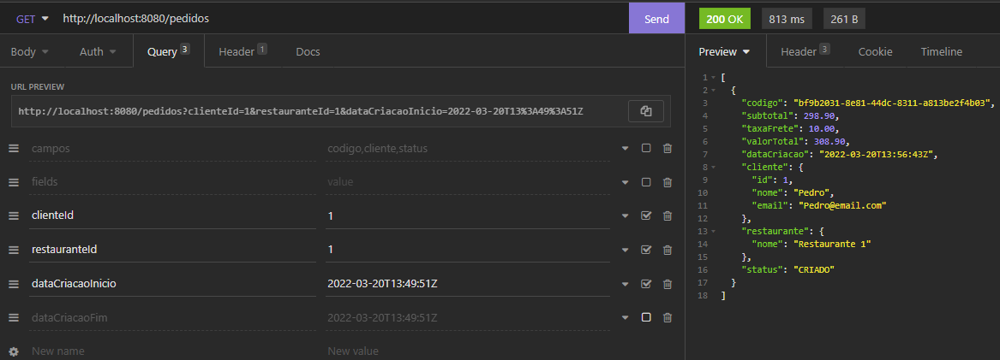
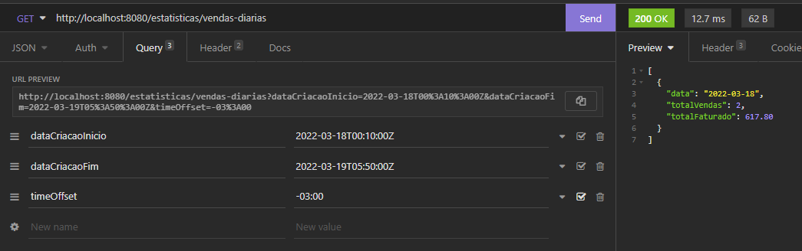

* As classes de domínio (por exemplo, CozinhaService) não devem ter contato com protocolo HTTP, não pode ter contato com Web.
* Isso é para outra camada da aplicação.
* Logo, exceções que devem retornar, por exemplo, HttpStatus.NOT_FOUND, é melhor estar no controller. 
* Neste exemplo, é usado exceção do tipo ResponseStatusException no controller através de um try/catch.

### Estendendo ResponseStatusException
* Extendemos a classe ResponseStatusException e crio 1 construtor a partir da superclasse que recebe como parâmetro 'status' e 'mensagem/reason', e assim é possível customizar o status e a reason. 
* Existe uma sobrecarga de construtores, que recebe como padrão HttpStatus.NOT_FOUND, permitindo ter flexibilidade de informar outro também.
* Na classe de 'service' não se muda nada. Mas, no controller não é necessário mais o catch, pois o EntidadeNaoEncontradaException é um ResponseStatusException(pois herda), então não é preciso tratar mais.
* VANTAGEM: é que quem lança a exception consegue customizar o código Http. Se fosse utilizado o @ResponseStatus, seria necessário criar outra classe de Exception. Por exemplo para BadRequest.
* DESVANTAGEM: customização dentro de uma classe de negócio.

### Simplificando o código com o uso de @ResponseStatus em exceptions
* Simplificamos ao substituir onde tem Optional/onde precisamos dar um findById.
* Colocamos em uma classe Service o código repetido de "findBy ou Falha"
>         return cozinhaRepository.findById(id)
>              .orElseThrow(() -> new EntidadeNaoEncontradaException("entidade não encontrada"));
* Na refatoração do método de Update, não é necessário mais verificar se cozinhaAtual é nula ou não com o if/isPresent(), porque agora nunca será nulo. Se não houver uma cozinha, será lançada a exception.
* Foram criadas duas constantes para mensagens na CozinhaService

### Criando a exception NegocioException
* Qualquer erro de negócio mais genérico, vamos mapear para Bad Request.

### Afinando a granularidade e definindo a hierarquia das exceptions de negócios
* A exception EntidadeNaoEncontradaException não detalha qual entidade se refere, pois é genérica.
* Quando temos uma exception com uma granularidade muito grossa, ou seja, muito genérica, não conseguimos tratá-la de uma forma muito específica.
* O dia que quisermos mudar a implementação, não lembraremos que precisaremos mudar no controller, que está sendo tratada como NegocioException.
* SOLUÇÃO: ao invés de lançar uma exception "EntidadeNaoEncontradaException", poderiamos lançar uma exception mais granular, mais específica, como por exemplo, EstadoNaoEncontradoException ou CidadeNaoEncontradaException.
* Ao criar uma exception mais granular, como por exemplo, EstadoNaoEncontradoException, vamos herdar de EntidadeNaoEncontradaException e assim, permitimos a quem for usar, podendo escolher entre fazer um catch na EntidadeNaoEncontrada(menos granular) ou na EstadoNaoEncontrado(mais granular).
* Como EntidadeNaoEncontradaException já tem o @ResponseStatus(HttpStatus.NOT_FOUND), não é necessario na classe que a herda.

### Tratando exceções em nível de controlador com @ExceptionHandler
* A partir da customização de mensagem pelo ExceptionHandler, obtém-se resposta como no exemplo abaixo:
>
>{
>"dataHora": "2022-03-04T17:30:02.3424591",
>"mensagem": "Cidade não foi encontrada com o número 15"
>}

### Tratando exceções globais com @ExceptionHandler e @ControllerAdvice
- O Exception Handler permite não só customizar as exceções criadas por nós, e do jeito que quisermos através do acesso ao ResponseEntity, mas também pode ser usada para tratamento de exceptions não criadas por nós, como no exemplo, onde tratamos exceção HttpMediaTypeNotSupportedException (requisição XML, enquanto que a aplicação aceita somente Json).

### Criando um exception handler global com ResponseEntityExceptionHandler
- A classe ResponseEntityExceptionHandler pode ser extendida em classes de ExceptionHandler globais como a ApiExceptionHandler. Esta classe trata exceptions internas do Spring MVC.
- Inclusive já trata a Exception do HttpMediaTypeNotSupported
- Por padrão ela não especifica nenhuma resposta.

### Tratando a exception InvalidFormatException na desserialização
- Biblioteca do projeto commons-lang (projeto do Apache) que fornece vários métodos utilitários para trabalhar mais facilmente com string, numeros e exceptions.
- ExceptionUtils.getRootCause() - neste método, passamos a exception ele retorna a causa raiz. Ele vai em toda a pilha de exceções e retorna a raiz.

### Habilitando erros na desserialização de propriedades inexistentes ou ignoradas
- spring.jackson.deserialization.fail-on-unknown-properties=true
- spring.jackson.deserialization.fail-on-ignored-properties=true

### Lançando exception de desserialização na atualização parcial (PATCH)
- Quando a requisição falhar/tiver uma propriedade que não exista, vai cair no catch IllegalArgumentException, onde pegamos a causa raiz e relançamos como HttpMessageNotReadableException, passando os argumentos como rootCause.
- Isso vai lançar a exception, e o ExceptionHandler vai reconhecer o HttpMessageNotReadableException. Passando pelo método, vai cair no else if do PropertyBindingException.

### Tratando exception de parâmetro de URL inválido
- MethodArgumentTypeMismatchException é um subtipo de TypeMismatchException .
- ResponseEntityExceptionHandler já trata TypeMismatchException de forma mais abrangente.
- Então, especializamos o método handleTypeMismatch e verificamos se a exception é uma instância de MethodArgumentTypeMismatchException.
- Se for, chamamos um método especialista em tratar esse tipo de exception.
- Poderíamos fazer tudo dentro de handleTypeMismatch, mas separaramos em outro método.

### Agrupando e restringindo constraints que devem ser usadas na validação
- Grupo padrão é Default.class
- Até podemos especificar @Validated(Default.class), mas é a mesma coisa que não ter, pois é default.

### Boas práticas para trabalhar com data e hora em REST APIs
- Use ISO-8601 para formatar data/hora
- Aceite qualquer fuso horário
- Armazene em UTC
- Retorne em UTC
- Não inclua o horário, se não for necessário
- Lembrar de definir serverTimeZone=UTC no driver JDBC em application.properties

### Granularidade de recursos: Chatty vs Chunky APIs
- Quando modelamos recursos de granularidade fina, tendemos a criar uma api Chatty Api (tradução: tagarela).
- O consumidor da API precisa fazer várias chamadas para exceutar uma única operação comum.
- Exemplo: Cadastrar um novo restaurante. Se o usuário precisa fazer um post no nome e depois um put para endereço e depois fazer novo put para ativar. e depois outro put para adicionar taxa de frete.

- Quando modelamos recursos de granularidade grossa, a API tende a ser Chunky API (tradução: pedaço grande).
- As operações são feitas em uma única requisição.

- Devemos sempre pensar no consumidor da api.
- Granularidade Fina - temos que tomar cuidado para não deixar o estado do recurso inconsistente. Exemplo: se o endereco do restaurante é obrigatório, mas separamos ele em um sub-recurso (/restaurantes/1/endereco), neste caso, o consumidor pode cadastrar um novo restaurante e, propositalmente ou não, não cadastrar um endereco, deixando o estado desse recurso inconsistente.
- Isso acaba por exigir uma sequencia para cadastramento (1 cadastrar o endereco, 2 definir o endereco para o restaurante, ...) e isso faz com que as regras da api fiquem do lado do usuario.

### Otimizando a query de pedidos e retornando model resumido na listagem
- Para fazer um findAll em pedidos, tinhamos um problema de N+1 com muitos selects.
* Para otimizar e transformar em um unico select:
@Query("from Pedido p join fetch p.cliente join fetch p.restaurante r join fetch r.cozinha")
List<Pedido> findAll();

* E Na Entidade Pedido:
@ManyToOne(fetch = FetchType.LAZY)
private FormaPagamento formaPagamento;

### Implementando pesquisas complexas na API

### Tratando time offset na agregação de vendas diárias por data

# Publicando Domain Events a partir do Aggregate Root
- Publicação de eventos deve ser feito sempre no Aggregate Root
- Toda alteração que fazemos num agregado, por exemplo - pedido e item pedido, deve ser feita a partir do agregate root - no caso, pedido.
- Tiramos a responsabilidade de enviar email da classe fluxo pedido, tirando todas as dependencias.
- Se precisarmos adicionar um novo requisito, uma nova funcionalidade, não é necessário mexer na classe FluxoPedido. Mas só criar um novo listener.

